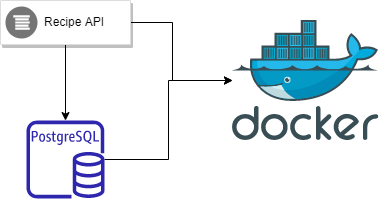
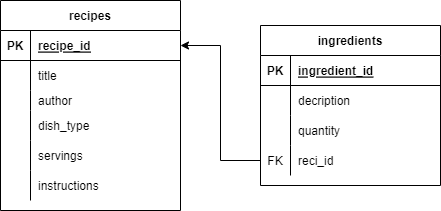

# recipes-api
Manage your favourite recipes with Recipe API

## Objective
Ths repository provides a standalone java application which allows users to manage their favourite recipes. It should
allow adding, updating, removing and fetching recipes. Additionally, users are able to filter
available recipes based on one or more of the following criteria:
1. Whether the dish is vegetarian or not
2. The number of servings
3. Specific ingredients (either include or exclude)
4. Text search within the instructions.
   For example, the API should be able to handle the following search requests:
   • All vegetarian recipes
   • Recipes that can serve 4 persons and have “potatoes” as an ingredient
   • Recipes without “salmon” as an ingredient that has “oven” in the instructions.

## Overview
A recipe mostly consists of ingredients and instructions. Additionally, title, servings count and dish type will be needed in the properties.

### High Level Design


### Database Design


### Tech Stack
* Java11
* Spring Boot
* Maven 3
* PostgreSQL
* Docker

## Running the application locally ##
### How do I get set up? ###

* Summary of set up: Assuming that docker has already been installed in your local machine, 
just clone the repository into a folder than run the command below 

```` docker-compose up -d ````

#### Running by IDE
* First create a PostgreSQL instance with the docker command below <br>
```docker run --name local-postgres -p 5432:5432 -e POSTGRES_PASSWORD=local -d recipe_db```

when the db instance is up and running, then update db url in `application-prod.yml` file. Later on you will be able to run the application from your favorite IDE

* when the application is up and running, hit the url http://localhost:9080/swagger-ui/index.html to access the API documentation

### How to test the application
* How to run tests: to run tests, execute the command below

#### Unit and Integration tests
````./mvn test````

#### End-to-end tests
````./mvn test````
I have already created a Postman collections to show example request.
[Download collections here](docs/recipe-api-collections.postman_collection.json)

## Workarounds
- The key feature to decide the database tool is to enable text search and indexing the text fields so that the users can query over ingredients and instructions part of the recipe.
    * Approach 1: NoSQL
    * Approach 2: RDS
    * Decision: Both RDS and NoSQL systems are capable of text search and indexing text columns. An index mostly increases the insert cost. Obvious solution is to scale the database instance as read and write databases. Since we have well structured data for the current requirements, an RDS is chosen. Postgresql is a very popular database and it is good at full text search issues.
- Another requirement for this project is to build dynamic queries. There are many ways to achieve this
    * Conditional where clause (old school practice)
    * JpaRepository -> find{entityName}By{propertyName}
    * Spring Data Examples API https://docs.spring.io/spring-data/commons/docs/current/api/org/springframework/data/domain/Example.html
    * Spring Data Specifications API https://docs.spring.io/spring-data/jpa/docs/current/api/org/springframework/data/jpa/domain/Specification.html
 Since Specifications API is more competent than the others, it will be preferred in this stack
- Yet another requirement is full text search issue. In my opinion, there are 2 options. First one is to handle it on the database side, the other one is to handle it in the codebase. Second option requires integration with Elastic search or Lucene by using Hibernate Search dependency and a lot of codebase stuff. First option requires some arrangements on the database but is easy to use. Since I preferred Postgresql, I will use Postgresql Full Text Search capability

